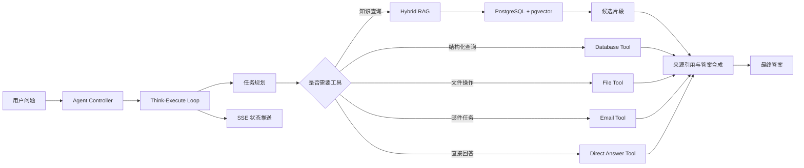

# 企业知识库混合检索 Agent 设计说明

## 1. 场景选择

企业内部知识通常分散在制度文档、技术 Wiki、项目复盘、接口文档、会议纪要和邮件记录中。传统关键词搜索容易漏掉同义表达，纯向量检索又可能召回语义相似但事实不匹配的内容。

本项目选择“企业知识库混合检索 Agent”作为开放式能力测评场景，目标是让用户用自然语言提问，系统自动完成任务理解、知识检索、工具调用、答案生成和来源追溯。

## 2. 用户问题示例

- “报销差旅费需要哪些材料？超过 30 天还能补交吗？”
- “帮我找一下支付回调接口的幂等处理方案。”
- “这个客户投诉应该查哪个知识库？给我整理处理步骤。”
- “把最近项目复盘里关于检索准确率的问题总结成三条改进建议。”

## 3. 总体架构



## 4. 核心工作流

1. **问题接收**：前端提交用户问题、会话 ID、Agent ID 和可选知识库 ID。
2. **任务规划**：Agent 将问题输入模型，判断需要直接回答还是调用工具。
3. **工具选择**：根据模型输出选择 KnowledgeTools、DataBaseTools、FileSystemTools、EmailTools 或 DirectAnswerTool。
4. **检索执行**：知识库工具调用 RAG 服务，完成召回、片段组织和上下文注入。
5. **答案生成**：模型基于用户问题、历史消息、工具结果和知识片段生成答案。
6. **状态推送**：SSE 将 THINKING、EXECUTING、DONE、ERROR 等状态实时推给前端。
7. **结果沉淀**：会话、消息、工具执行结果和知识库元数据落库，便于复盘。

## 5. 混合检索设计

现有代码已具备基于 bge-m3 embedding 与 pgvector 的向量检索能力。为了更适合企业真实场景，本作品在设计层面补充混合检索方案：

### 5.1 文档处理

- 支持 Markdown 文档上传和解析。
- 按标题、段落、列表、代码块进行结构化切分。
- 为每个 chunk 保存 `document_id`、`title_path`、`content`、`token_count`、`metadata`。
- 对 chunk 生成 bge-m3 embedding 并写入 pgvector。

### 5.2 召回策略

- **关键词召回**：使用 PostgreSQL full-text search 或 BM25 服务召回包含关键术语、编号、接口名、制度条款的文档片段。
- **向量召回**：使用 bge-m3 embedding 与 pgvector `<->` 距离召回语义相关片段。
- **规则召回**：对接口名、错误码、制度编号、表名、日期等强精确字段进行过滤。

### 5.3 融合与重排

- 使用 RRF 将关键词召回和向量召回结果融合。
- 对候选片段按知识库、更新时间、标题层级、重复度进行过滤。
- 可选接入 reranker 模型，对 top 20 候选重排为 top 5。

### 5.4 答案约束

- 答案必须基于召回片段，不确定时明确说明缺少依据。
- 输出引用来源，包括文档标题、章节路径和 chunk 编号。
- 对流程类问题输出步骤，对比较类问题输出表格，对风险类问题输出注意事项。

## 6. 关键模块映射

| 能力 | 代码位置 | 说明 |
| --- | --- | --- |
| Agent 状态机 | `JChatMind-main/jchatmind/src/main/java/com/kama/jchatmind/agent/AgentState.java` | 定义 THINKING、EXECUTING、DONE、ERROR 等执行状态 |
| Agent Loop | `JChatMind-main/jchatmind/src/main/java/com/kama/jchatmind/agent/JChatMind.java` | 负责多轮思考、工具调用和结束控制 |
| Agent 工厂 | `JChatMind-main/jchatmind/src/main/java/com/kama/jchatmind/agent/JChatMindFactory.java` | 创建不同配置的 Agent 实例 |
| 工具抽象 | `JChatMind-main/jchatmind/src/main/java/com/kama/jchatmind/agent/tools/` | 数据库、文件、邮件、知识库等工具 |
| RAG 服务 | `JChatMind-main/jchatmind/src/main/java/com/kama/jchatmind/service/impl/RagServiceImpl.java` | 调用 bge-m3 embedding 并执行向量检索 |
| SSE 推送 | `JChatMind-main/jchatmind/src/main/java/com/kama/jchatmind/service/impl/SseServiceImpl.java` | 推送 Agent 执行过程 |
| 前端界面 | `JChatMind-main/ui/src/` | 管理 Agent、知识库、会话与聊天 |

## 7. 数据表设计要点

- `knowledge_base`：知识库信息。
- `document`：文档元数据、文件路径、解析状态。
- `chunk_bge_m3`：文档片段、embedding、元数据。
- `agent`：Agent 配置，包括可用工具、模型配置和提示词。
- `chat_session`：用户会话。
- `chat_message`：多轮消息与工具结果。

## 8. Agent 提示词策略

系统提示词强调三条约束：

1. 先判断是否需要检索或工具调用，不要急于直接回答。
2. 对知识库问题必须返回依据，无法确认时说明不确定。
3. 工具执行失败时给出下一步建议，而不是编造结果。

示例：

```text
你是企业知识库 Agent。回答前先判断问题是否需要检索、数据库查询或文件工具。
如果使用知识库，请只基于检索片段回答，并在答案末尾列出引用来源。
如果证据不足，请明确说明缺少哪些资料。
```

## 9. 可量化指标

| 指标 | 目标 |
| --- | --- |
| 普通知识库问答响应 | 3 秒内返回首 token 或状态 |
| top5 召回准确率 | 85%+，通过人工标注问题集评估 |
| Agent 最大执行步数 | 默认 8 步，防止无限循环 |
| 文档切分粒度 | 300-800 tokens，保留标题路径 |
| 引用完整率 | 所有知识库答案均附来源 |

## 10. 后续优化

- 增加 BM25 表和 RRF 融合实现，将设计层面的混合检索落到代码。
- 接入 reranker，例如 bge-reranker 或轻量 cross-encoder。
- 增加评测集，记录问题、标准答案、命中文档、召回排名和最终评分。
- 加入权限过滤，保证不同部门只能检索授权知识库。
- 引入 LoRA 微调后的领域模型，改善企业术语理解和答案格式稳定性。

